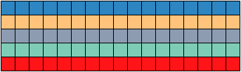

## CUDA 中 FFT 的使用

@(10.CUDA)[CUDA,并行，fft]

### 1. 流程

1. 使用`cufftHandle`创建句柄
2. 使用`cufftPlan1d()`,`cufftPlan3d()`,`cufftPlan3d()`,`cufftPlanMany()`对句柄进行配置，主要是配置句柄对应的信号长度，信号类型，在内存中的存储形式等信息。
    + `cufftPlan1d()`：针对单个 1 维信号
    + `cufftPlan2d()`：针对单个 2 维信号
    + `cufftPlan3d()`：针对单个 3 维信号
    + `cufftPlanMany()`：针对多个信号同时进行 fft
3. 使用`cufftExec()`函数执行 fft
4. 使用`cufftDestroy()`函数释放 GPU 资源

### 2. 单个 1 维信号的 fft

假设要执行 fft 的信号`data_dev`的长度为`N`，并且已经传输到 GPU 显存中，`data_dev`数据的类型为`cufftComplex`，可以用一下方式产生主机段的`data_dev`，如下所示：



```cu
    cufftComplex *data_Host = (cufftComplex*)malloc(NX*BATCH*sizeof(cufftComplex)); // 主机端数据头指针

    // 初始数据
    for (int i = 0; i < NX; i++)
    {
        data_Host[i].x = float((rand() * rand()) % NX) / NX;
        data_Host[i].y = float((rand() * rand()) % NX) / NX;
    }
```

然后用`cudaMemcpy()`将主机端的`data_host`拷贝到设备端的`data_dev`，即可用下述方法执行 fft ：

```cu
    cufftHandle plan; // 创建cuFFT句柄
    cufftPlan1d(&plan, N, CUFFT_C2C, BATCH);
    cufftExecC2C(plan, data_dev, data_dev, CUFFT_FORWARD); // 执行 cuFFT，正变换
```

`cufftPlan1d()`：

+ 第一个参数就是要配置的 cuFFT 句柄；
+ 第二个参数为要进行 fft 的信号的长度；
+ 第三个`CUFFT_C2C`为要执行 fft 的信号输入类型及输出类型都为复数；`CUFFT_C2R`表示输入复数，输出实数；`CUFFT_R2C`表示输入实数，输出复数；`CUFFT_R2R`表示输入实数，输出实数；
+ 第四个参数`BATCH`表示要执行 fft 的信号的个数，新版的已经使用`cufftPlanMany()`来同时完成多个信号的 fft。

`cufftExecC2C()`：

+ 第一个参数就是配置好的 cuFFT 句柄；
+ 第二个参数为输入信号的首地址；
+ 第三个参数为输出信号的首地址；
+ 第四个参数`CUFFT_FORWARD`表示执行的是 fft 正变换；`CUFFT_INVERSE`表示执行 fft 逆变换。

> 需要注意的是，执行完逆 fft 之后，要对信号中的每个值乘以 $\frac{1}{N}$

完整代码：[GitHub](https://github.com/muzichao/Learning/tree/master/CUDA-learning/cufft/single_1D)

### 3. 多个 1 维信号的 fft

要进行多个信号的 fft，就不得不使用 `cufftPlanMany` 函数，该函数的参数比较多，需要特别介绍，

```cpp
cufftPlanMany(cufftHandle *plan, int rank, int *n, 
              int *inembed, int istride, int idist, 
              int *onembed, int ostride, int odist, 
              cufftType type, int batch);
```

为了叙述的更准确，此处先引入一个图，表示输入数据在内存中的布局，如下图所示，数据在内存中按行优先存储，但是现有的信号为一列表示一个信号，后四列灰白色的表示无关数据，要对前 12 个彩色的列信号分别进行 fft。


+ plan：表示 cufft 句柄
+ rank：表示进行 fft 的每个信号的维度数，一维信号为 1，二维信号为2，三维信号为 3 ，针对上图，rank = 1
+ n：表示进行 fft 的每个信号的行数，列数，页数，必须用数组形式表示，例如假设要进行 fft 的每个信号的行、列、页为(m, n, k)，则 int n[rank] = {m, n, k}；针对上图，int n[1] = {5}
+ inembed：表示输入数据的[页数，列数，行数]，这是三维信号的情况；二维信号则为[列数，行数]；一维信号为[行数]；inembed[0] 这个参数会被忽略，也就是此处 inembed 可以为{0}，{1}，{2}等等。
+ istride：表示每个输入信号相邻两个元素的距离，在此处 istride = 16（每个信号相邻两个元素间的距离为16）
+ idist：表示两个连续输入信号的起始元素之间的间隔，在此处为 idist = 1（第一个信号的第一个元素与第二个信号的第一个元素的间隔为1）；如果把上图数据的每一行看成一个信号，那么应该为 idist = 16；
+  onembed：表示输出数据的[页数，列数，行数]，这是三维信号的情况；二维信号则为[列数，行数]；一维信号为[行数]；onembed[0] 这个参数会被忽略，也就是此处 onembed 可以为{0}，{1}，{2}等等。
+ ostride：表示每个输出信号相邻两个元素的距离，在此处 ostride = 16（每个信号相邻两个元素间的距离为16）
+ odist：表示两个连续信号的起始元素之间的间隔，在此处为 odist = 1（第一个信号的第一个元素与第二个信号的第一个元素的间隔为1）；如果把上图数据的每一行看成一个信号，那么应该为 odist = 16；

如下所示：是第 b 个信号的 [z][y][x] （表示第 z 列，第 y 行，第 x 页的元素）的索引（由于 c 和 c++ 中数组的声明方式的问题，array[X][Y][Z]表示数组有 X 页，Y 行，Z 列） ：

> ‣ 1D
>> input[ b * idist + x * istride ]
>> output[ b * odist + x * ostride ]
>
> ‣ 2D
>> input[ b * idist + (x * inembed[1] + y) * istride ]
>> output[ b * odist + (x * onembed[1] + y) * ostride ]
>
> ‣ 3D
>> input[b * idist + (x * inembed[1] * inembed[2] + y * inembed[2] + z) * istride]
>> output[b * odist + (x * onembed[1] * onembed[2] + y * onembed[2] + z) * ostride]

```cpp
    /* 申请 cufft 句柄*/
    cufftHandle plan_Nfft_Many; // 创建cuFFT句柄
    const int rank = 1; // 一维 fft
    int n[rank] = { Nfft }; // 进行 fft 的信号的长度为 Nfft
    int inembed[1] = { 0 }; // 输入数据的[页数，列数，行数](3维)；[列数，行数]（2维）
    int onembed[1] = { 0 }; // 输出数据的[页数，列数，行数]；[列数，行数]（2维）
    int istride = NXWITH0; // 每个输入信号相邻两个元素的距离
    int idist = 1; // 每两个输入信号第一个元素的距离
    int ostride = NXWITH0; // 每个输出信号相邻两个元素的距离
    int odist = 1; // 每两个输出信号第一个元素的距离
    int batch = NX; // 进行 fft 的信号个数
    cufftPlanMany(&plan_Nfft_Many, rank, n, inembed, istride, idist, onembed, ostride, odist, CUFFT_C2C, batch);

    /* 核心部份 */

    cudaMemcpy(data_dev, data_Host, Nfft * NXWITH0 * sizeof(cufftComplex), cudaMemcpyHostToDevice);
    cufftExecC2C(plan_Nfft_Many, data_dev, data_dev, CUFFT_FORWARD); // 执行 cuFFT，正变换
    cufftExecC2C(plan_Nfft_Many, data_dev, data_dev, CUFFT_INVERSE); // 执行 cuFFT，逆变换
    CufftComplexScale<<<dimGrid2D_NXWITH0_Nfft, dimBlock2D>>>(data_dev, data_dev, 1.0f / Nfft); // 乘以系数
    cudaMemcpy(resultIFFT, data_dev, Nfft * NXWITH0 * sizeof(cufftComplex), cudaMemcpyDeviceToHost);
```

完整代码：[GitHub](https://github.com/muzichao/Learning/tree/master/CUDA-learning/cufft)

### 参考

1. CUDA官方文档《CUFFT Library》
