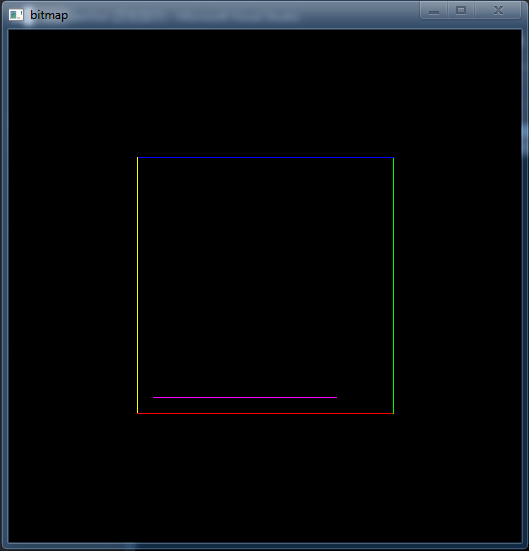
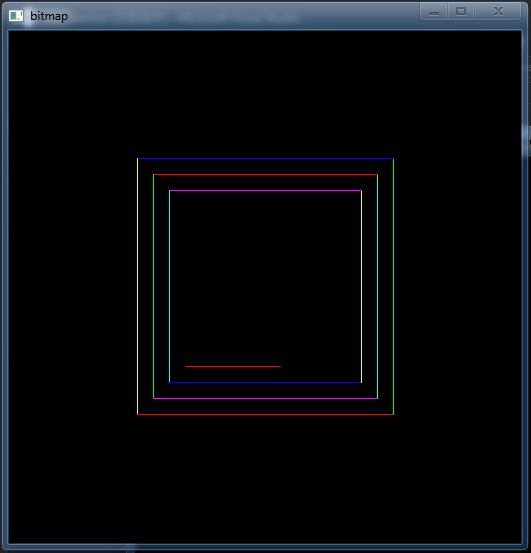
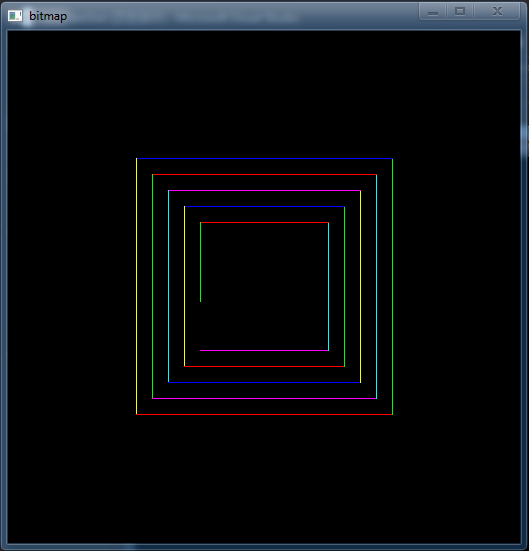

## freeglut 使用笔记

### 1. 介绍

GLUT 代表 OpenGL 应用工具包，英文全称为 OpenGL Utility Toolkit，是一个和窗口系统无关的软件包，可以跨平台使用，而 freeglut 是 GLUT 的一个完全开源替代库，对 GLUT 进行了扩展，本文使用的就是 freeglut 开源库。

### 2. glut 部分函数详解

```cpp
void glut Init(int *argc, char **argv);
```

这个函数用来初始化 GLUT 库，这个函数的参数从 main 函数获取，也可以直接定义，格式比较固定，如下所示：

```cpp
int numInit = 1;
char* InitDummy = "";
glutInit(&numInit, &InitDummy);
```
---------------------------

```cpp
void glutInitDisplayMode(unsigned int mode); 
```

这个函数设置图形的显示模式，参数 mode 可选为：

+ GLUT_RGBA：默认的使用模式，表示欲简历 RGBA 模式的窗口。
+ GLUT_SINGLE：只使用单缓存
+ GLUT_DOUBLE：使用双缓存，避免在刷新图形的时候出现`闪屏`，`白屏`或者图形不动的问题，在显示动画是很有用。
+ GLUT_DEPTH：使用深度缓存

多个选项可以同时使用，如下所示：

```cpp
glutInitDisplayMode(GLUT_DOUBLE | GLUT_RGBA);  // 双缓冲缓冲，RGBA格式
```
----------------------------------
```cpp
void glutInitWindowPosition(int x, int y); 
```

设置初始窗口的位置，窗口左上角相对于桌面坐标(x，y)，如下所示：

```cpp
glutInitWindowPosition(1, 1); 
```
-------------------------------

```cpp
void glutInitWindowSize(int width, int height); 
```

设置初始窗口的大小，width 为窗口图形的列数，height 为窗口图形的行数，如下所示：

```cpp
glutInitWindowSize(512, 512); 
```
-------------------------------------
```cpp
void glutMainLoop(void); 
```

让glut程序进入事件循环.在一个glut程序中最多只能调用一次,且必须调用.一旦调用,会直到程序结束才返回。而 freeglut 库对该函数进行了扩展，对应的是`glutMainLoopEvent()`，该函数可以自动退出。

```cpp
glutMainLoop(); 

或

glutMainLoopEvent();
```
---------------------------------------------------
```cpp
int glutCreateWindow(const char *title);
```
产生一个顶层的窗口。title作为窗口的名字，也就是窗口标题栏显示的内容。返回值是生成窗口的标记符，可用函数`glutGetWindow()`加以引用，也可以使用`glutDestroyWindow(int win)`函数将其销毁。用法如下：

```cpp
int win =  glutCreateWindow("figure");

...

glutDestroyWindow(win);
```

------------------------
```cpp
void glutPostRedisplay(void);
```
标记当前窗口的图像层需要重新绘制，在`glutMainLoop`或`glutMainLoopEvent`函数的事件处理循环的下一个循环中，将调用该窗口的显示回调函数重绘该窗口的图像层。在动画显示中非常有用。用法如下：

```cpp
glutPostRedisplay();
```

-------------------------------------
```cpp
void glutSwapBuffers(void);
```
当窗口模式为双缓存时，此函数的功能就是把后台缓存的内容交换到前台显示。当然，只有单缓存时，使用它的功能跟用glFlush()一样。而使用双缓存是为了把完整图画一次性显示在窗口上，或者是为了实现动画。用法如下：

```cpp
glutSwapBuffers();
```
----------------------------------------
```cpp
void glutSetOption ( GLenum option_flag, int value );
```
设置窗口的状态和选项。
+ GLUT_ACTION_ON_WINDOW_CLOSE
+ GLUT_ACTION_EXIT
+ GLUT_ACTION_GLUTMAINLOOP_RETURNS 
+  GLUT_ACTION_CONTINUE_EXECUTION 

用法如下：

```cpp
glutSetOption(GLUT_ACTION_ON_WINDOW_CLOSE, GLUT_ACTION_GLUTMAINLOOP_RETURNS);
```
----
```cpp
void glutDisplayFunc(void (*func)(void));
```

注册当前窗口的显示回调函数。参数 func 为 void func() 的函数，完成具体的绘制操作这个函数告诉 GLUT 当窗口内容必须被绘制时，那个函数将被调用。当窗口改变大小或者从被覆盖的状态中恢复，或者由于调用`glutPostRedisplay()`函数要求GLUT更新时，执行func参数指定的函数。用法如下：

```cpp

static void Display(void)
{
    Bitmap *bitmap = *(get_bitmap_ptr());
    glClearColor(0.0, 0.0, 0.0, 1.0);
    glClear(GL_COLOR_BUFFER_BIT);
    glDrawPixels(bitmap->col, bitmap->row, GL_RGBA, GL_UNSIGNED_BYTE, bitmap->pixels);
    glFlush();
    glutSwapBuffers(); // 双缓冲缓存
}

...

glutDisplayFunc(Display);
    
```
-----------------------------------
```cpp
void glutKeyboardFunc(void (*func)(unsigned char key, int x, int y));
```
注册当前窗口的键盘回调函数，参数 func 为 void func(unsigned char key, int x, int y)，key 为按键的ASCII码x,y 为当按下键时鼠标的坐标，相对于窗口左上角，以像素为单位，当敲击键盘按键(除了特殊按键，即`glutSpecialFunc()`中处理的按键，详见`glutSpecialFunc()`)时调用。用法如下：

```cpp
void processKeys(unsigned char key, int x, int y) 
{
 
    if (key == 27)
    {
        glutLeaveMainLoop();
     }
}
```

###3. 一个例子

首先定义一个 Bitmap 类，需要把`freeglut.h`，`freeglut_ext.h`，`freeglut_std.h`，`glut.h`，`freeglut.lib`，`freeglut.dll`添加到相应的库目录。

```cpp

class Bitmap
{
public:
    unsigned char *pixels; // 指向数据的内存区域
    int col, row; // 宽和高

    /* 构造函数，初始化 */
    Bitmap(int width, int height)
    {
        Bitmap **bitmap = get_bitmap_ptr();
        *bitmap = this;
        pixels = (unsigned char*)malloc(width * height * 4 * sizeof(unsigned char));
        memset(pixels, 0, width * height * 4 * sizeof(unsigned char));
        col = width;
        row = height;
    }

    /* 析构函数 */
    ~Bitmap()
    {
        delete[] pixels;
    }
    /* 图像内存首地址*/
    unsigned char* get_ptr(void) const   
    { 
        return pixels; 
    }

    /* 显示初始化 */
    void DisplayInit()
    {
        int numInit = 1;
        char* InitDummy = "";
        glutInit(&numInit, &InitDummy); // 初始化
        glutInitDisplayMode(GLUT_DOUBLE | GLUT_RGBA);  // 双缓冲缓冲，RGBA格式
        glutInitWindowPosition(1, 1); // 窗口起始位置，相对显示器的左上角位置
        glutInitWindowSize(col, row); // 窗口初始大小
        glutCreateWindow("bitmap"); // 创建窗口
        glutSetOption(GLUT_ACTION_ON_WINDOW_CLOSE, GLUT_ACTION_GLUTMAINLOOP_RETURNS);
    }

    /* 显示更新 */
    void Imshow()
    {
        glutDisplayFunc(Display); // 显示
        glutMainLoopEvent(); // 使用glutMainLoop() 将不会退出
        glutPostRedisplay(); // 刷新
    }

private:
    // static method used for glut callbacks
    static Bitmap** get_bitmap_ptr(void)
    {
        static Bitmap *gBitmap;
        return &gBitmap;
    }

    /* 显示函数 */
    static void Display(void)
    {
        Bitmap *bitmap = *(get_bitmap_ptr());
        glClearColor(0.0, 0.0, 0.0, 1.0);
        glClear(GL_COLOR_BUFFER_BIT);
        glDrawPixels(bitmap->col, bitmap->row, GL_RGBA, GL_UNSIGNED_BYTE, bitmap->pixels);
        glFlush();
        glutSwapBuffers(); // 双缓冲缓存
    }
};
```

使用类：

```cpp
    int col = 512;
    int row = 512;

    Bitmap bitmap(col, row);
    unsigned char *ptr = bitmap.get_ptr();
    bitmap.DisplayInit(); // 初始化

    for(;;)
    {
        /* 此处完成图像的更新 */ 
        bitmap.Imshow();
    }
```

上述代码就可以完成一个动画的绘制和显示，其中的几个如下所示：








### 4. 参考

[freeglut下载](http://freeglut.sourceforge.net/)
[本文完整代码](https://github.com/muzichao/Learning/tree/master/OpenGL/testFreeglut)
